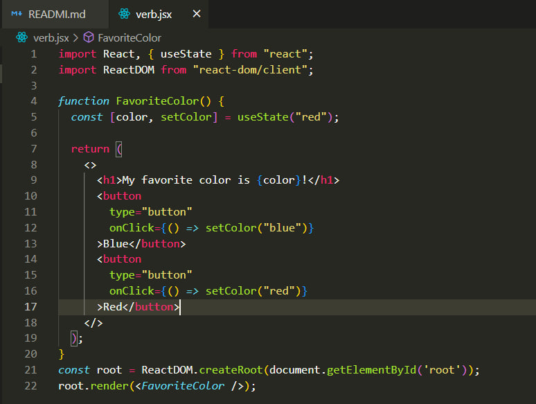
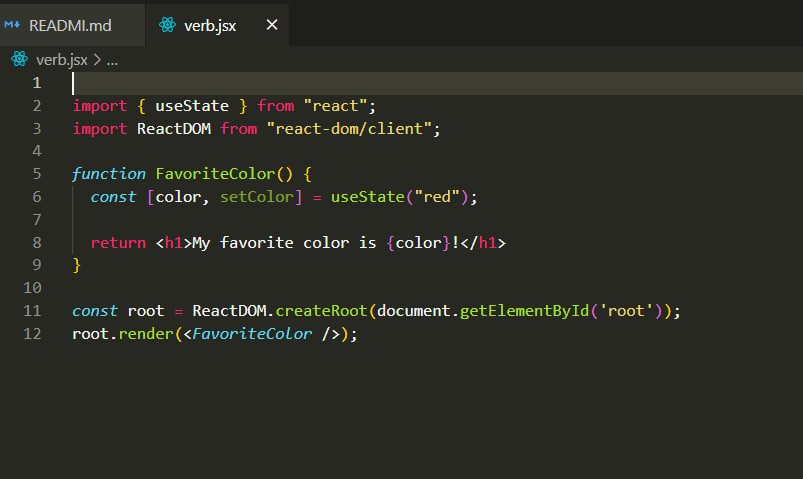
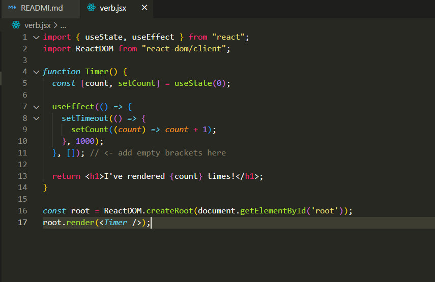

# React Hook
## What's the hook in react?
### Hooks are functions that let you “hook into” React state and lifecycle features from function components. Hooks don't work inside classes — they let you use React without classes. (We don't recommend rewriting your existing components overnight but you can start using Hooks in the new ones if you'd like.)

# import useState
### The React useState Hook allows us to track state in a function component.
### State generally refers to data or properties that need to be tracking in an application.

# React useEffect Hooks
### The useEffect Hook allows you to perform side effects in your components.Some examples of side effects are: fetching data, directly updating the DOM, and timers.useEffect accepts two arguments. The second argument is optional.useEffect(<function>, <dependency>)

# React useContext Hook
### React Context is a way to manage state globally.It can be used together with the useState Hook to share state between deeply nested components more easily than with useState alone.
## The Problem
### State should be held by the highest parent component in the stack that requires access to the state.To illustrate, we have many nested components. The component at the top and bottom of the stack need access to the state.To do this without Context, we will need to pass the state as "props" through each nested component. This is called "prop drilling".

# React useRef Hook
### The useRef Hook allows you to persist values between renders.It can be used to store a mutable value that does not cause a re-render when updated.It can be used to access a DOM element directly

# React useReducer Hook
### The useReducer Hook is similar to the useState Hook.It allows for custom state logic.If you find yourself keeping track of multiple pieces of state that rely on complex logic, useReducer may be useful.

# React useCallback Hook
### The React useCallback Hook returns a memoized callback function.Think of memoization as caching a value so that it does not need to be recalculated.This allows us to isolate resource intensive functions so that they will not automatically run on every render.The useCallback Hook only runs when one of its dependencies update.This can improve performance.

# React useMemo Hook
### The React useMemo Hook returns a memoized value.Think of memoization as caching a value so that it does not need to be recalculated.The useMemo Hook only runs when one of its dependencies update.This can improve performance.

# React Custom Hooks
### Hooks are reusable functions.When you have component logic that needs to be used by multiple components, we can extract that logic to a custom Hook.Custom Hooks start with "use". 